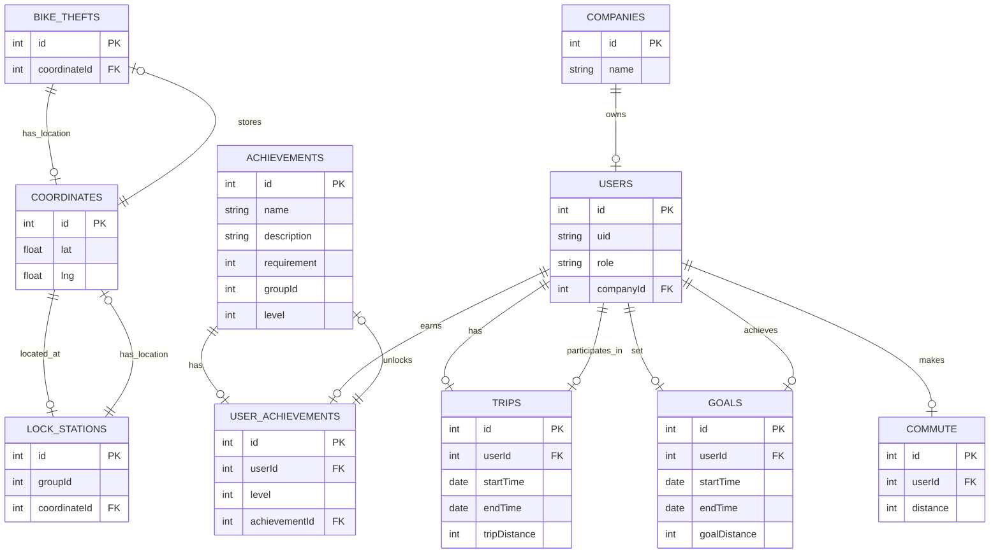

```mermaid
erDiagram
  ACHIEVEMENTS {
    int id PK
    string name
    string description
    int requirement
    int groupId
    int level
  }

  BIKE_THEFTS {
    int id PK
    int coordinateId FK
  }

  COMMUTE {
    int id PK
    int userId FK
    int distance
  }

  COMPANIES {
    int id PK
    string name
  }

  COORDINATES {
    int id PK
    float lat
    float lng
  }

  GOALS {
    int id PK
    int userId FK
    date startTime
    date endTime
    int goalDistance
  }

  LOCK_STATIONS {
    int id PK
    int groupId
    int coordinateId FK
  }

  TRIPS {
    int id PK
    int userId FK
    date startTime
    date endTime
    int tripDistance
  }

  USERS {
    int id PK
    string uid
    string role
    int companyId FK
  }

  USER_ACHIEVEMENTS {
    int id PK
    int userId FK
    int level
    int achievementId FK
  }

  ACHIEVEMENTS ||--o| USER_ACHIEVEMENTS: has
  USERS ||--o| USER_ACHIEVEMENTS: earns
  USERS ||--o| TRIPS: has
  COMPANIES ||--o| USERS: owns
  COORDINATES ||--o| BIKE_THEFTS: stores
  COORDINATES ||--o| LOCK_STATIONS: located_at
  USERS ||--o| GOALS: set
  USERS ||--o| COMMUTE: makes
  USERS ||--o| GOALS: achieves
  USERS ||--o| TRIPS: participates_in
  USER_ACHIEVEMENTS ||--o| ACHIEVEMENTS: unlocks
  LOCK_STATIONS ||--o| COORDINATES: has_location
  BIKE_THEFTS ||--o| COORDINATES: has_location

```
