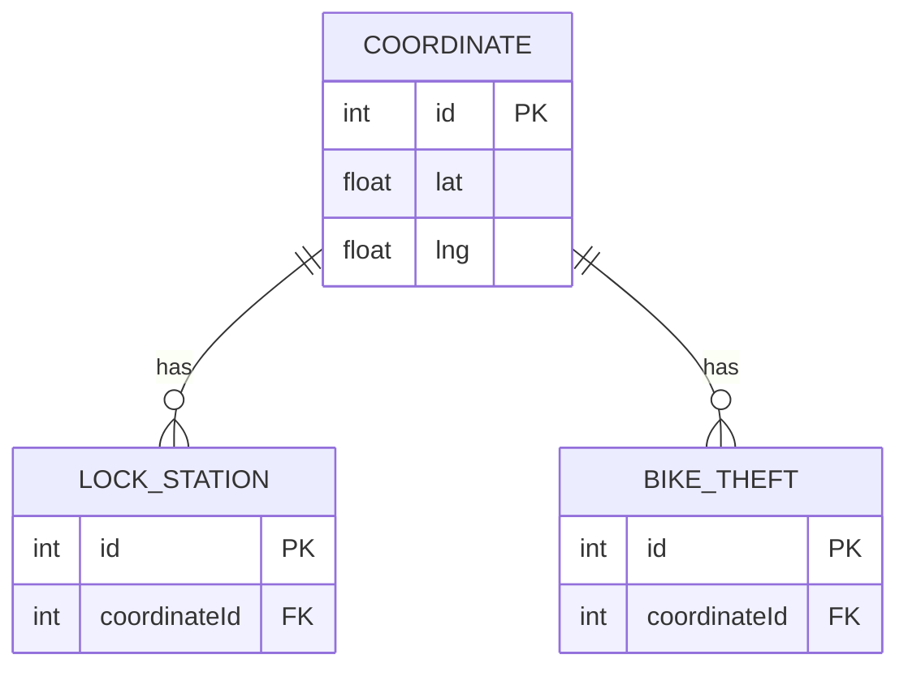

```mermaid
erDiagram
    COORDINATE {
        int id PK
        float lat
        float lng
    }

    LOCK_STATION {
        int id PK
        int coordinateId FK
    }

    BIKE_THEFT {
        int id PK
        int coordinateId FK
    }

    COORDINATE ||--o{ LOCK_STATION : has
    COORDINATE ||--o{ BIKE_THEFT : has
```
